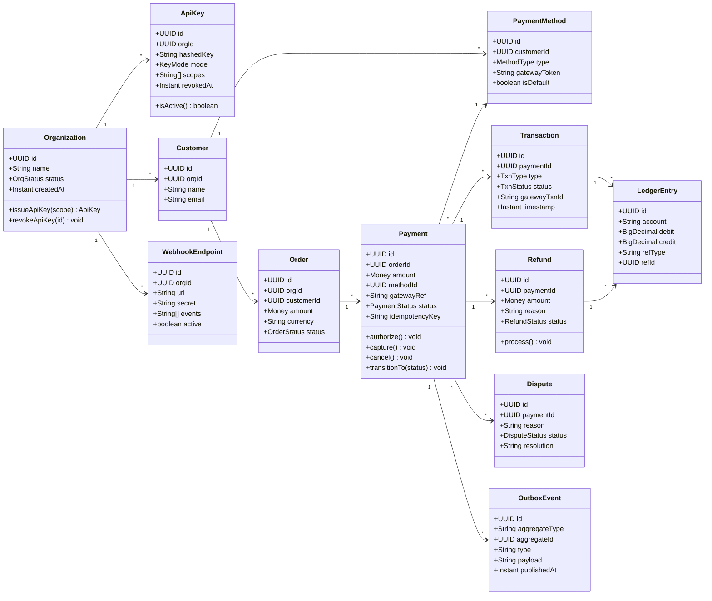
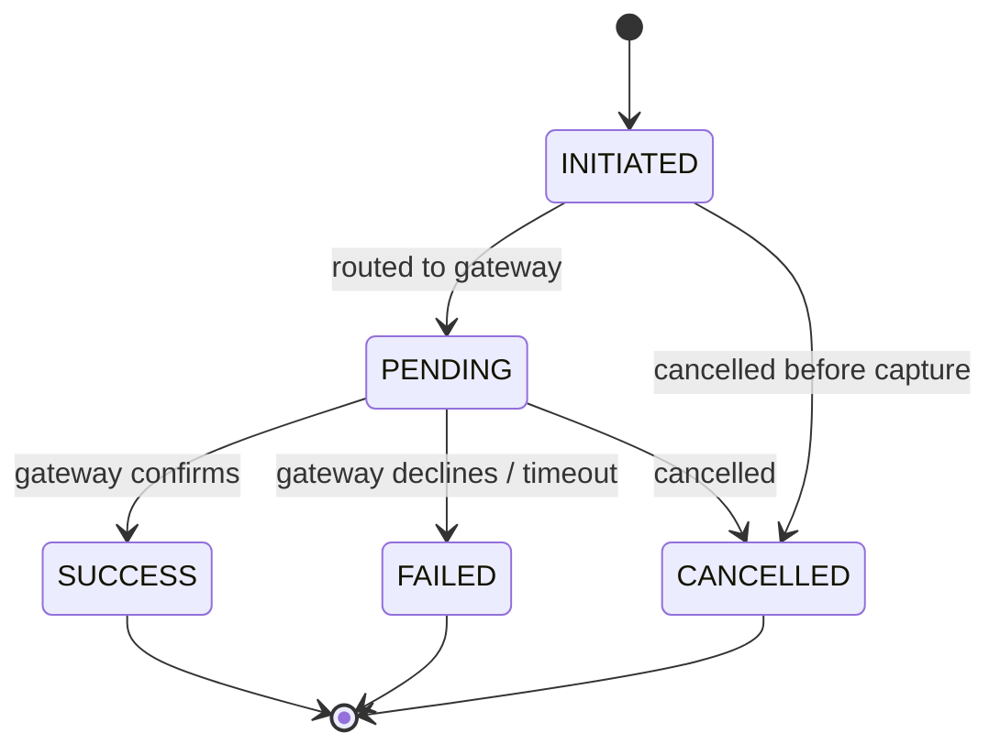
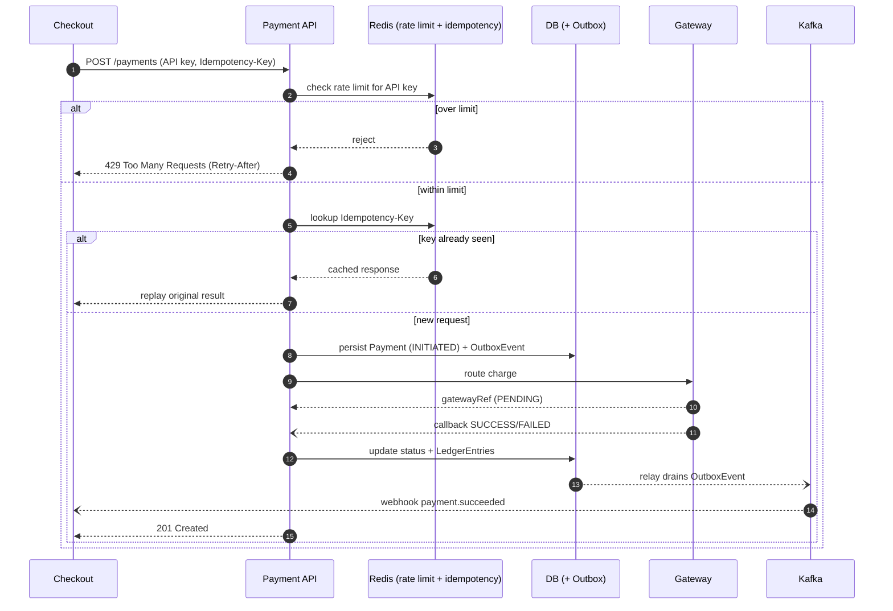
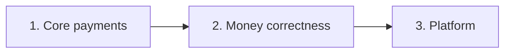

<div align="center">

# PayOne

### A payments API with idempotency, a double-entry ledger, and event-driven webhooks

</div>

<div align="center">


</div>

---

This is a project I built to get the hard parts of a payments backend right rather than to ship a wide feature set. The interesting work isn't the CRUD around orders and customers — it's making money operations **correct, idempotent, and auditable** under retries, partial failures, and duplicate gateway callbacks.

I deliberately kept the scope narrow so I can defend every line of it. There are no subscriptions, no analytics warehouse, and no ML fraud scoring here — those are easy to bolt on later, and leaving them out keeps the core honest.

## Contents

- [What it does](#what-it-does)
- [Why these choices](#why-these-choices)
- [Tech stack](#tech-stack)
- [Scope](#scope)
- [Features](#features)
- [Non-functional targets](#non-functional-targets)
- [Domain model](#domain-model)
- [Entity relationship diagram](#entity-relationship-diagram)
- [Class diagram](#class-diagram)
- [Payment state machine](#payment-state-machine)
- [Payment flow](#payment-flow)
- [REST API](#rest-api)
- [Rate limiting](#rate-limiting)
- [Build phases](#build-phases)
- [Running locally](#running-locally)

## What it does

PayOne is a multi-tenant, API-first service that lets a merchant accept a payment, refund it, and stay reconciled with the gateway — while every state change is published reliably to downstream consumers via webhooks. A mock gateway stands in for the real acquiring bank so the whole lifecycle is testable end to end.

## Why these choices

A few opinions baked into this repo:

- **Idempotency is not optional on money endpoints.** Clients retry. Networks drop responses. Every charge goes through an `Idempotency-Key` so a retry returns the original result instead of charging twice.
- **The ledger is the source of truth, not the `payment.status` column.** Status is a convenience; the double-entry ledger is what has to balance. Reconciliation is just "do our entries sum to what the gateway settled."
- **Don't publish events in the same breath as the HTTP call.** I use a transactional outbox so the DB write and the "event will be published" promise commit together. A relay drains the outbox to Kafka. No lost events, no phantom events on rollback.
- **State transitions are explicit and enforced.** A payment can't go from `FAILED` back to `SUCCESS`. Illegal transitions throw, they don't silently no-op.
- **H2 in dev is a convenience, not the database.** The persistence layer is written so moving to Postgres is a config change, not a rewrite.

## Tech stack

| Layer | Choice |
|---|---|
| Framework | Spring Boot (Web, Security, Validation) |
| Persistence | JPA + H2 (dev) -> PostgreSQL (prod) |
| Cache / rate limiting | Redis |
| Eventing | Apache Kafka (via transactional outbox) |
| Resilience | resilience4j (circuit breakers, retries) |
| Observability | Spring Boot Actuator |
| API docs | springdoc-openapi (Swagger UI) |

## Scope

**In scope**

- Payment orchestration: checkout -> gateway -> status lifecycle
- Refunds and ledger-backed reconciliation
- Multi-tenant org/merchant management with scoped API keys
- Rate limiting per API key
- Outbound webhooks and idempotent inbound gateway callbacks
- Developer sandbox, OpenAPI docs, and dispute tracking

**Out of scope (on purpose)**

- The real card network / acquiring bank — mocked gateway
- A consumer web/mobile UI — API-first
- Storing raw card data — tokenize via the gateway, never store the PAN
- Subscriptions, analytics, and fraud scoring — intentionally left out to keep the core defensible

## Features

### Payments

- Internal `/payments` API that checkout calls to start a payment for an order
- Cart -> Order -> Payment conversion
- Routes to a configured gateway and captures its reference
- Explicit state machine: `INITIATED -> PENDING -> SUCCESS / FAILED / CANCELLED`
- Idempotency on every money-mutating request via a client `Idempotency-Key`
- Multiple payment methods: card, net banking, UPI, wallet
- Gateway errors mapped to stable, documented error codes

### Rate limiting

- Redis token-bucket limiter, scoped per API key
- Separate buckets for test vs live keys
- Returns `429 Too Many Requests` with a `Retry-After` header
- Limits are config-driven so they can be tuned per route without a deploy

### Refunds and reconciliation

- Full and partial refunds against a successful payment
- Every money movement is written as balanced double-entry ledger rows
- Scheduled reconciliation compares internal records against gateway settlement and flags mismatches
- Confirmed failure or timeout auto-triggers a compensating refund

### Multi-tenancy and access

- Organizations (merchants) with strict per-tenant data isolation on every query
- Scoped API keys in test and live modes; issue and revoke
- Role-based access: `OWNER`, `ADMIN`, `DEVELOPER`

### Webhooks and notifications

- Domain events (`payment.succeeded`, `refund.created`, etc.) emitted to Kafka through the outbox
- Outbound webhooks to merchant endpoints with signed payloads and retries
- Inbound gateway callbacks ingested idempotently

### Developer platform

- Sandbox environment with test credentials and simulated gateway outcomes
- OpenAPI docs served via Swagger UI
- Transaction history and receipt retrieval
- Dispute / chargeback submission and resolution tracking

## Non-functional targets

| Area | Target |
|---|---|
| Performance | p99 API latency under 300ms excluding the downstream gateway |
| Scalability | Stateless services behind a load balancer; Kafka partitions for parallelism; Redis for hot reads and rate limiting |
| Reliability | Retries with exponential backoff, resilience4j circuit breakers, and a DLQ for poison events |
| Data integrity | Exactly-once financial effect via idempotency keys plus a transactional outbox; the ledger never goes out of balance |
| Security | Tokenize and never store the PAN; secrets encrypted at rest; TLS in transit; signed webhooks; API-key + role auth |
| Observability | Structured logs, correlation IDs, Actuator metrics, and an audit trail on every money operation |
| Multi-tenancy | Tenant scoping enforced on every query; no cross-org leakage |

## Domain model

| Entity | Purpose | Key fields |
|---|---|---|
| Organization | Tenant / merchant | id, name, status, createdAt |
| ApiKey | Auth credential per org | id, orgId, hashedKey, mode, scopes, revokedAt |
| User | Org member / actor | id, orgId, name, email, role |
| Customer | The payer | id, orgId, name, email, contact |
| PaymentMethod | Tokenized instrument | id, customerId, type, gatewayToken, isDefault |
| Cart | Pre-checkout selection | id, customerId, items, total, status |
| Order | Checked-out cart | id, orgId, customerId, amount, currency, status |
| Payment | Charge attempt against an order | id, orderId, amount, currency, methodId, gatewayRef, status, idempotencyKey |
| Transaction | Money event (charge/refund) | id, paymentId, type, status, gatewayTxnId, timestamp |
| Refund | Reversal of a payment | id, paymentId, amount, reason, status |
| LedgerEntry | Double-entry record | id, account, debit, credit, refType, refId, currency |
| GatewayConfig | Downstream connection | id, orgId, provider, endpoints, credentialsRef |
| Dispute | Chargeback / complaint | id, paymentId, reason, status, resolution |
| WebhookEndpoint | Merchant callback target | id, orgId, url, secret, events, active |
| WebhookEvent | Inbound/outbound event log | id, type, payload, status, attempts |
| OutboxEvent | Transactional outbox -> Kafka | id, aggregateType, aggregateId, type, payload, publishedAt |
| IdempotencyKey | Dedup store (Redis + DB) | key, requestHash, responseSnapshot, createdAt |
| AuditLog | Compliance trail | id, orgId, actor, action, target, timestamp |


## Class diagram



## Payment state machine



## Payment flow



## REST API

Everything is versioned under `/api/v1`, authenticated with an API key, and scoped to the caller's org.

**Auth and organization**

| Method | Path | Description |
|---|---|---|
| POST | `/orgs` | Register an organization |
| POST | `/auth/login` | Authenticate a user, issue a token |
| POST | `/api-keys` | Create a scoped API key |
| GET | `/api-keys` | List keys |
| DELETE | `/api-keys/{id}` | Revoke a key |

**Customers and payment methods**

| Method | Path | Description |
|---|---|---|
| POST | `/customers` | Create a customer |
| GET | `/customers/{id}` | Get a customer |
| POST | `/customers/{id}/payment-methods` | Add a tokenized method |
| GET | `/customers/{id}/payment-methods` | List methods |
| DELETE | `/payment-methods/{id}` | Remove a method |

**Checkout and payments**

| Method | Path | Description |
|---|---|---|
| POST | `/orders` | Create an order from a cart |
| POST | `/payments` | Initiate payment (requires Idempotency-Key) |
| GET | `/payments/{id}` | Get a payment and its status |
| GET | `/payments` | List / filter payments |
| POST | `/payments/{id}/capture` | Capture an authorized payment |
| POST | `/payments/{id}/cancel` | Cancel a pending payment |

**Refunds and disputes**

| Method | Path | Description |
|---|---|---|
| POST | `/payments/{id}/refunds` | Issue a full or partial refund |
| GET | `/refunds/{id}` | Get refund status |
| POST | `/disputes` | Open a dispute |
| PATCH | `/disputes/{id}` | Update or resolve a dispute |

**Webhooks**

| Method | Path | Description |
|---|---|---|
| POST | `/webhook-endpoints` | Register a merchant callback URL |
| GET | `/webhook-endpoints` | List endpoints |
| POST | `/webhooks/gateway` | Inbound gateway callback (idempotent) |

## Rate limiting

Rate limiting runs as a filter in front of the API, backed by a Redis token bucket keyed on the API key. I keep separate buckets for test and live keys so a misbehaving sandbox integration can't eat a merchant's live budget. When a bucket is empty the request gets a `429` with a `Retry-After` header, and the limits are read from config so they can be tuned per route without a redeploy.

```
bucket key:   rl:{apiKeyId}:{route}
algorithm:    token bucket (capacity + refill rate per second)
store:        Redis (atomic check-and-decrement via Lua)
response:     429 Too Many Requests + Retry-After
```

## Build phases

I sequenced this so the repo always compiles and runs end to end at each step.



1. **Core payments** — Org / ApiKey, Customer, Order, Payment, the mock gateway, idempotency, the state machine, and rate limiting.
2. **Money correctness** — the double-entry ledger, refunds, reconciliation, and the transactional outbox to Kafka.
3. **Platform** — outbound and inbound webhooks, disputes, the developer sandbox, and OpenAPI docs.

## Running locally

```bash
# 1. Clone
git clone https://github.com/<your-username>/payone.git
cd payone

# 2. Spin up infra (Kafka, Redis, Postgres)
docker compose up -d

# 3. Run the app (dev profile uses H2)
./mvnw spring-boot:run -Dspring-boot.run.profiles=dev

# 4. Open the API docs
open http://localhost:8080/swagger-ui.html
```

Initiate a payment:

```bash
curl -X POST http://localhost:8080/api/v1/payments \
  -H "Authorization: Bearer <API_KEY>" \
  -H "Idempotency-Key: 9f1c2b7a-4d3e-4a1f-bc11-3e2d1f0a9b8c" \
  -H "Content-Type: application/json" \
  -d '{
        "orderId": "ord_123",
        "methodId": "pm_456",
        "amount": 1999,
        "currency": "INR"
      }'
```

Retrying that exact request with the same `Idempotency-Key` returns the original payment instead of creating a second charge — which is the whole point.
